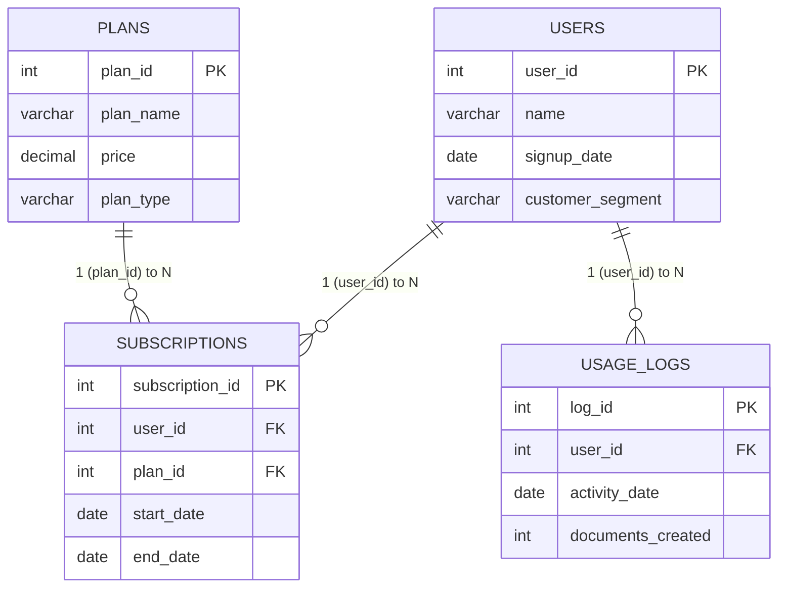

# WriteWise — AI Writing Platform | SQL Analytics Project

**Type:** SQL Project · **Database:** MySQL · **Author's approach:** End-to-end — business understanding → dataset design → SQL setup → analysis → recommendations

---

## 1. Business Understanding

**Scenario:** WriteWise is an AI-powered writing platform used by professionals and businesses. The user base is growing, but leadership doesn't know whether growth is translating into sustainable business value. Some users are highly engaged; others drop off quickly. Usage also varies by customer segment and subscription plan.

**Objective** — Analyze WriteWise's user and business data to understand:
- Is user growth translating into business value?
- Which users are highly engaged vs. those who drop off?
- How does usage vary across subscription plans and customer groups?
- What factors might be driving these differences?

**Key metrics focused on:**
- User growth (signups over time)
- User engagement (documents created)
- Subscription plan distribution (Free / Starter / Pro / Business)
- Free-to-paid behavior differences
- Churn (ended subscriptions, inactive users)
- Plan-wise / segment-wise performance

---

## 2. Dataset Design

A simple relational schema with **4 related tables**, populated with realistic dummy data.

| Table | Purpose | Key Columns | Rows |
|---|---|---|---|
| `users` | Stores user information | `user_id` (PK), `name`, `signup_date`, `customer_segment` | 15 |
| `plans` | Stores subscription plan details | `plan_id` (PK), `plan_name`, `price`, `plan_type` | 4 |
| `subscriptions` | Maps users to their subscribed plan | `subscription_id` (PK), `user_id` (FK), `plan_id` (FK), `start_date`, `end_date` | 15 |
| `usage_logs` | Tracks user activity (documents created) | `log_id` (PK), `user_id` (FK), `activity_date`, `documents_created` | 30 |

**Why these choices:**
- `customer_segment` (Individual / Small Business / Enterprise) is evenly split across 15 users (5 each) so segment comparisons aren't skewed by sample size.
- `signup_date` spans **Jan–Apr 2026**, enabling a signup-trend analysis.
- `plans` includes 1 **Free** tier and 3 **Paid** tiers (Starter, Pro, Business) — needed to answer the Free-vs-Paid engagement question.
- `end_date = NULL` in `subscriptions` = active; a populated `end_date` = churned. 3 of 15 subscriptions are ended, enough to demonstrate churn logic without dominating the sample.
- `usage_logs` has ~2 records/user on average (roughly monthly), with a deliberate **zero-activity row** and **two users with no logs at all** (user 10, user 13) — this exercises `LEFT JOIN`/anti-join logic and low-engagement detection.
- Plan assignment is mixed across segments on purpose (not simply "Enterprise = Business plan") so relationships are *discovered* by the SQL rather than hard-coded into the data.

---

## 3. Entity-Relationship (ER) Diagram

**Relationships:**
- `users (1) —— (N) subscriptions` via `user_id` — one user can have multiple subscriptions over time (plan changes); in this sample data, 1 per user.
- `plans (1) —— (N) subscriptions` via `plan_id` — one plan can be assigned to many subscriptions.
- `users (1) —— (N) usage_logs` via `user_id` — one user can have many activity records.
- `subscriptions` is the bridge table resolving the users↔plans many-to-many relationship.

---

## 4. Analysis Plan (Key Business Questions & Actual Answers)

All figures below were calculated directly from the data inserted in `01_writewise_dataset.sql` (15 users, 15 subscriptions, 30 usage records, total documents created = 347) and cross-checked so every breakdown reconciles back to that 347 total.

| # | Question | Answer (computed from the dataset) |
|---|---|---|
| 1 | How has user growth been over time? (signup trend) | Signups by month: **Jan = 4, Feb = 3, Mar = 4, Apr = 4** (15 users total, Jan–Apr 2026). Growth is steady rather than accelerating — roughly 3–4 new users every month, no single month drives acquisition. |
| 2 | What is overall user engagement? (documents/user) | **347 total documents** across 30 activity records → **11.57 docs/activity record** on average. Spread across all 15 users (including the 2 with zero activity) → **23.13 docs/user** on average. Range: **0 (min) to 30 (max)** in a single activity record. |
| 3 | Which user segments are most engaged? | **Enterprise: 221 docs / 5 users = 44.2 avg** (highest) → **Small Business: 109 docs / 5 users = 21.8 avg** → **Individual: 17 docs / 5 users = 3.4 avg** (lowest). Enterprise users are roughly **13x** more engaged than Individual users on average. |
| 4 | Which subscription plans have the highest usage? | **Business: 117 docs / 2 users = 58.5 avg** (highest) → **Pro: 177 docs / 5 users = 35.4 avg** → **Starter: 42 docs / 3 users = 14.0 avg** → **Free: 11 docs / 5 users = 2.2 avg** (lowest). Usage scales with plan tier almost monotonically. |
| 5 | How does Free vs. Paid usage compare? | **Free: 11 docs / 5 users = 2.2 avg/user.** **Paid (Starter+Pro+Business combined): 336 docs / 10 users = 33.6 avg/user.** Paid users are **~15x** more engaged than Free users. |
| 6 | Which users are inactive / at risk of churn? | **2 users have zero usage logs at all: Divya (user 10) and Suresh (user 13).** **3 subscriptions have ended: Sneha (user 4, Free), Kiran (user 7, Starter), Divya (user 10, Free)** — i.e., **20% churn rate** (3 of 15). Engagement-tier breakdown across all 15 users: **Inactive (0 docs) = 2 users, Low (1–10) = 4 users (Arjun, Sneha, Kiran, Neha), Moderate (11–30) = 5 users (Priya, Rohit, Aditya, Kavya, Nikhil), High (>30) = 4 users (Rahul, Vikram, Ananya, Meera).** |
| 7 | Comparison of engagement across segments and plans | Segment ranking: **Enterprise (44.2) > Small Business (21.8) > Individual (3.4)**. Plan ranking: **Business (58.5) > Pro (35.4) > Starter (14.0) > Free (2.2)**. Both rankings point the same direction — segments/plans associated with paying more also use the product more, reinforcing that engagement and monetization move together here. |

**Supporting detail — monthly document volume (all users combined):**

| Month | Total Documents | Activity Records | Avg Docs/Record | Change vs. Prior Month |
|---|---|---|---|---|
| Jan | 20 | 4 | 5.00 | — |
| Feb | 54 | 7 | 7.71 | +34 |
| Mar | 97 | 9 | 10.78 | +43 |
| Apr | 116 | 7 | 16.57 | +19 |
| May | 60 | 3 | 20.00 | **−56** |

Platform-wide volume climbed every month from January through April, then dropped sharply in May — driven by fewer users logging activity that month (only users 12, 14, 15), even though those remaining users each posted their highest individual numbers.

**Individual user ranking by total documents (highest to lowest):** Ananya (69) > Rahul (55) > Meera (48) > Vikram (43) > Kavya (30) > Rohit (26) > Nikhil (23) > Priya (20) > Aditya (15) > Arjun (9) > Kiran (7) > Sneha (1) = Neha (1) > Divya (0) = Suresh (0).

**SQL techniques demonstrated:** `GROUP BY`/`HAVING`, aggregate functions (`SUM`, `AVG`, `MIN`, `MAX`, `COUNT`), `CASE` bucketing, `LEFT JOIN` + `IS NULL` anti-joins, `INNER JOIN` across 3 tables, CTEs (`WITH`), window functions (`RANK() OVER`, `LAG() OVER`), date functions (`MONTH()`).

---

## 5. Project Files

| File | Purpose |
|---|---|
| `01_writewise_dataset.sql` | Database/table creation (DDL) + dummy data inserts (DML) for all 4 tables |
| `02_basic_sql_analysis.sql` | Foundational analysis — counts, aggregates, filters, grouping (15 queries) |
| `03_advanced_sql_analysis.sql` | Advanced analysis — joins, CTEs, window functions, segmentation (8 queries) |
| `README.md` | This file — schema documentation, ER diagram, design rationale, findings |

**How to run:** Execute in MySQL in numeric order (`01` → `02` → `03`). Syntax used (`AUTO_INCREMENT`, `SHOW TABLES`) is MySQL-specific.

---

## 6. Key Findings

- **3.Q1) Engagement is uneven across the user base** — total documents per user ranges from **0 (Divya, Suresh) to 69 (Ananya)**, with 4 users classified High (>30 docs), 5 Moderate (11–30), 4 Low (1–10), and 2 Inactive (0).
- **3.Q4) Two users (Divya – user 10, Suresh – user 13) have zero recorded usage activity at all** despite holding subscriptions — churn-risk candidates.
- **3.Q2) Enterprise segment shows the highest average engagement (44.2 docs/user)**, more than double Small Business (21.8) and roughly 13x Individual (3.4).
- **3.Q3) Business-tier subscribers show the highest average engagement (58.5 docs/user)**, followed by Pro (35.4), Starter (14.0), and Free (2.2). **Paid users overall (33.6 avg) are ~15x more engaged than Free users (2.2 avg).**
- **3.Q7) Platform-wide monthly document volume rose steadily from January (20) through April (116), then dropped to 60 in May** — a plateau/decline signal worth monitoring, though driven mainly by fewer users logging activity that month rather than a drop in per-user output.
- **2. Q9) 3 of 15 subscriptions (20%) have ended** (Sneha, Kiran, Divya), and two of those three churned users (Sneha: 1 doc, Divya: 0 docs) were also among the lowest-engagement users in the dataset — consistent with engagement being a leading indicator of churn.

---

## 7. Additional Business Question Identified

> **"Is declining engagement a leading indicator of churn — do users who eventually cancel show a downward usage trend in the months before their `end_date`, and can that trend be used to flag currently active users who are at risk of churning?"**

**Why this question:** The data already shows that ended subscriptions cluster among lower-engagement users, and two users show *no* activity at all. The natural next step is to trace each churned user's `usage_logs` trajectory leading up to their `end_date`, then apply the same trend logic (e.g., month-over-month decline via `LAG()`) to currently active users to build an early-warning / churn-risk signal — turning a descriptive finding into a predictive, actionable one for the business.

---

## 8. Assumptions & Limitations

- Dataset is synthetic, deliberately kept small (15 users / 30 usage records) for reviewability — not statistically representative of a real production platform.
- "Active" subscription status is inferred purely from `end_date IS NULL`; there is no explicit `status` column.
- `usage_logs` is modeled as a periodic (roughly monthly) snapshot per user, not event-level logging of every document.
- There is no revenue/MRR table; "business value" is approximated qualitatively through plan price and engagement, not calculated as a standalone metric in these scripts.
- Foreign keys enforce referential integrity (`subscriptions.user_id → users.user_id`, `subscriptions.plan_id → plans.plan_id`, `usage_logs.user_id → users.user_id`), so no orphaned records exist in the sample data.
