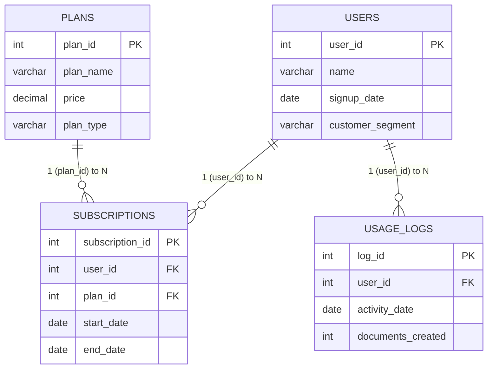

# WriteWise — AI Writing Platform | SQL Analytics Project

**Type:** Graded SQL Project · **Database:** MySQL · **Author's approach:** End-to-end — business understanding → dataset design → SQL setup → analysis → recommendations

---

## 1. Business Understanding

**Scenario:** WriteWise is an AI-powered writing platform used by professionals and businesses. The user base is growing, but leadership doesn't know whether growth is translating into sustainable business value. Some users are highly engaged; others drop off quickly. Usage also varies by customer segment and subscription plan.

**Objective** — Analyze WriteWise's user and business data to understand:
- Is user growth translating into business value?
- Which users are highly engaged vs. those who drop off?
- How does usage vary across subscription plans and customer groups?
- What factors might be driving these differences?

**Key metrics focused on:**
- User growth (signups over time)
- User engagement (documents created)
- Subscription plan distribution (Free / Starter / Pro / Business)
- Free-to-paid behavior differences
- Churn (ended subscriptions, inactive users)
- Plan-wise / segment-wise performance

---

## 2. Dataset Design

A simple relational schema with **4 related tables**, populated with realistic dummy data.

| Table | Purpose | Key Columns | Rows |
|---|---|---|---|
| `users` | Stores user information | `user_id` (PK), `name`, `signup_date`, `customer_segment` | 15 |
| `plans` | Stores subscription plan details | `plan_id` (PK), `plan_name`, `price`, `plan_type` | 4 |
| `subscriptions` | Maps users to their subscribed plan | `subscription_id` (PK), `user_id` (FK), `plan_id` (FK), `start_date`, `end_date` | 15 |
| `usage_logs` | Tracks user activity (documents created) | `log_id` (PK), `user_id` (FK), `activity_date`, `documents_created` | 30 |

**Why these choices:**
- `customer_segment` (Individual / Small Business / Enterprise) is evenly split across 15 users (5 each) so segment comparisons aren't skewed by sample size.
- `signup_date` spans **Jan–Apr 2026**, enabling a signup-trend analysis.
- `plans` includes 1 **Free** tier and 3 **Paid** tiers (Starter, Pro, Business) — needed to answer the Free-vs-Paid engagement question.
- `end_date = NULL` in `subscriptions` = active; a populated `end_date` = churned. 3 of 15 subscriptions are ended, enough to demonstrate churn logic without dominating the sample.
- `usage_logs` has ~2 records/user on average (roughly monthly), with a deliberate **zero-activity row** and **two users with no logs at all** (user 10, user 13) — this exercises `LEFT JOIN`/anti-join logic and low-engagement detection.
- Plan assignment is mixed across segments on purpose (not simply "Enterprise = Business plan") so relationships are *discovered* by the SQL rather than hard-coded into the data.

---

## 3. Entity-Relationship (ER) Diagram

**Relationships:**
- `users (1) —— (N) subscriptions` via `user_id` — one user can have multiple subscriptions over time (plan changes); in this sample data, 1 per user.
- `plans (1) —— (N) subscriptions` via `plan_id` — one plan can be assigned to many subscriptions.
- `users (1) —— (N) usage_logs` via `user_id` — one user can have many activity records.
- `subscriptions` is the bridge table resolving the users↔plans many-to-many relationship.

---

## 4. Analysis Plan (Key Business Questions)

| # | Question | Where Answered |
|---|---|---|
| 1 | How has user growth been over time? (signup trend) | `02_basic_sql_analysis.sql` Q3 |
| 2 | What is overall user engagement? (documents/user) | `02_basic_sql_analysis.sql` Q4–Q8; `03_advanced_sql_analysis.sql` Q1 |
| 3 | Which user segments are most engaged? | `03_advanced_sql_analysis.sql` Q2 |
| 4 | Which subscription plans have the highest usage? | `03_advanced_sql_analysis.sql` Q3 |
| 5 | How does Free vs. Paid usage compare? | `03_advanced_sql_analysis.sql` Q8 |
| 6 | Which users are inactive / at risk of churn? | `03_advanced_sql_analysis.sql` Q4; `02_basic_sql_analysis.sql` Q9–Q11 |
| 7 | Comparison of engagement across segments and plans | `03_advanced_sql_analysis.sql` Q2, Q3, Q5, Q6 |
| 8 | Additional business question (from findings) | See Section 7 below |

**SQL techniques demonstrated:** `GROUP BY`/`HAVING`, aggregate functions (`SUM`, `AVG`, `MIN`, `MAX`, `COUNT`), `CASE` bucketing, `LEFT JOIN` + `IS NULL` anti-joins, `INNER JOIN` across 3 tables, CTEs (`WITH`), window functions (`RANK() OVER`, `LAG() OVER`), date functions (`MONTH()`).

---

## 5. Project Files

| File | Purpose |
|---|---|
| `01_writewise_dataset.sql` | Database/table creation (DDL) + dummy data inserts (DML) for all 4 tables |
| `02_basic_sql_analysis.sql` | Foundational analysis — counts, aggregates, filters, grouping (15 queries) |
| `03_advanced_sql_analysis.sql` | Advanced analysis — joins, CTEs, window functions, segmentation (8 queries) |
| `README.md` | This file — schema documentation, ER diagram, design rationale, findings |

**How to run:** Execute in MySQL in numeric order (`01` → `02` → `03`). Syntax used (`AUTO_INCREMENT`, `SHOW TABLES`) is MySQL-specific.

---

## 6. Key Findings

- **Engagement is uneven across the user base** — total documents per user ranges from 0 up to 78+, with a small group of power users and several low/no-activity users.
- **Two users (Divya – user 10, Suresh – user 13) have zero recorded usage activity** despite holding subscriptions — clear re-engagement/churn-risk candidates.
- **Enterprise segment shows the highest average documents/user**, followed by Small Business, then Individual — suggesting higher willingness-to-pay segments are also the most active.
- **Higher-tier plans (Pro, Business) show higher average usage than Starter/Free**, and **Paid users overall show substantially higher engagement than Free users** — a signal the Free tier may under-activate users rather than convert them.
- **Platform-wide monthly document volume rose from January through April 2026, then dipped in May** — an early plateau signal worth monitoring.
- **3 of 15 subscriptions (20%) have ended**, and churned users generally show lower engagement than active users — consistent with engagement being a leading indicator of churn.

---

## 7. Additional Business Question Identified

> **"Is declining engagement a leading indicator of churn — do users who eventually cancel show a downward usage trend in the months before their `end_date`, and can that trend be used to flag currently active users who are at risk of churning?"**

**Why this question:** The data already shows that ended subscriptions cluster among lower-engagement users, and two users show *no* activity at all. The natural next step is to trace each churned user's `usage_logs` trajectory leading up to their `end_date`, then apply the same trend logic (e.g., month-over-month decline via `LAG()`) to currently active users to build an early-warning / churn-risk signal — turning a descriptive finding into a predictive, actionable one for the business.

---

## 8. Assumptions & Limitations

- Dataset is synthetic, deliberately kept small (15 users / 30 usage records) for reviewability — not statistically representative of a real production platform.
- "Active" subscription status is inferred purely from `end_date IS NULL`; there is no explicit `status` column.
- `usage_logs` is modeled as a periodic (roughly monthly) snapshot per user, not event-level logging of every document.
- There is no revenue/MRR table; "business value" is approximated qualitatively through plan price and engagement, not calculated as a standalone metric in these scripts.
- Foreign keys enforce referential integrity (`subscriptions.user_id → users.user_id`, `subscriptions.plan_id → plans.plan_id`, `usage_logs.user_id → users.user_id`), so no orphaned records exist in the sample data.
